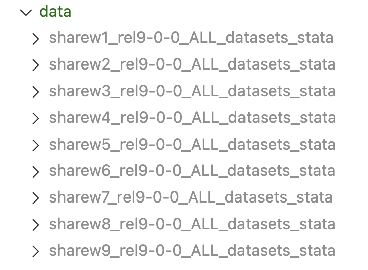
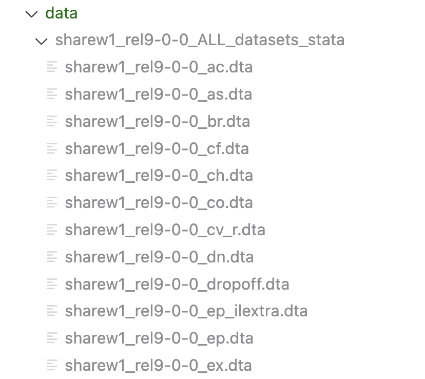

```{r setup, include=FALSE}
knitr::opts_chunk$set(
    echo = TRUE,
    warning = FALSE,
    message = FALSE
)
```

<br>


# Installation

At the moment, the application is only available locally. To run the application, you need to:

<br>

## Clone the repository

You need to have `Git` installed on your machine. If you don't, you can download it [here](https://git-scm.com/downloads).

Then you can clone the repository by running the following command in your terminal:

```bash
git clone https://github.com/JosephBARBIERDARNAL/autoSHARE.git
```

<br>

## Install the required packages

It is recommended to create a [virtual environment](https://docs.python.org/3/library/venv.html) before installing the required packages. This will **prevent any conflicts** with other Python projects you may have on your machine.

You can do so by running the following command in your terminal:

```bash
python -m venv venv
source venv/bin/activate
```

To **install the required packages**, you can run the following command in your terminal:

```bash
pip install -r requirements.txt
```

<br>

## Set up the data

Our goal is to create a make an app that does not require this step (aka a **deployment on a server** with the data already loaded). However, for now, the data needs to be set up locally.

[SHARE](https://share-eric.eu/) requires to ask and justify the use of their data. This means that this will **not work if don't have local access to the data**.

The quickest way to set up the data is to download the data (stata files) from the SHARE data center, unzip them, and place them in the `data/` directory. However, here are more detailed instructions if needed:

- Inside the `data/` directory, create a new directory for each wave, and keep their original names. For example, wave 1 directory is named `sharew1_rel9-0-0_ALL_datasets_stata`. This should look like this:

    
    <i>Figure 1: Data directory structure</i>

- Inside each wave directory, put all raw `.dta` files. This should look like this for the wave 1 directory:

    
    <i>Figure 2: Data files in wave 1 directory</i>

<br>

## Run the application

To run the application, you can run the following command in your terminal:

```bash
streamlit run AutoSHARE.py
```

This will open a **new tab** in your default browser with the application running, usually at the **following address**: `http://localhost:8501`.
