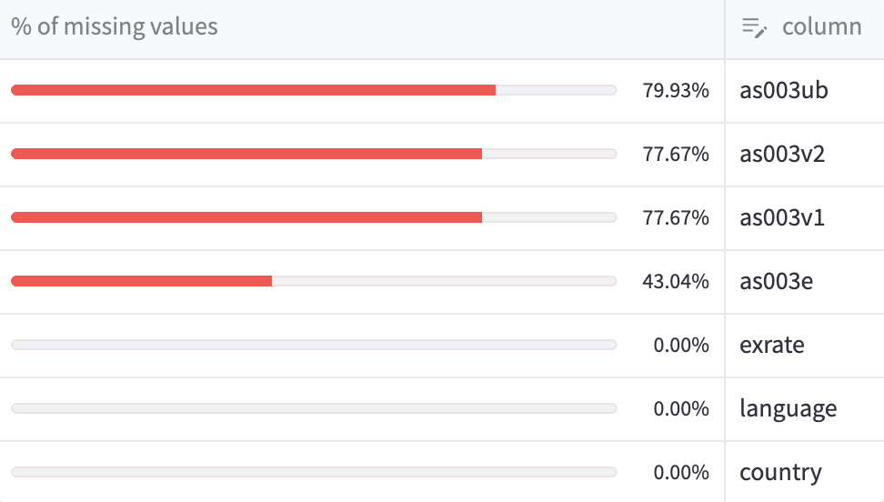

```{r setup, include=FALSE}
knitr::opts_chunk$set(
    echo = TRUE,
    warning = FALSE,
    message = FALSE
)
```

<br>

# About
***

The missing values module is used to manage missing values in the dataframe. It contains different methods, for detection, imputation and deletion of missing values.

It's stored at: `root/src/data/missing_values.py`

<br>

# Methods
***

## Missing codes

- `replace_missing_codes()`

In [SHARE](https://share-eric.eu/), some responses such as "Don't know" or "Refused" are categories in themselves. But for most SHARE data users, these responses are considered as missing values. The method `replace_missing_codes()` is used to replace these responses by `None`.

This method is used according to a boolean user input within the app. If the user wants to replace missing codes, the method is called. Otherwise, the method is not called.

## Explicit missing values

- `make_explicit_na()`

This methods is used to replace missing values by a given explicit value. By default, it replaces missing values by `"missing"`. This type of method can be used when missing values are not missing at random.

This method is used according to a boolean user input within the app. If the user wants to make missing values explicit, the method is called. Otherwise, the method is not called.

## Number of missing values per column

- `count_na_columns()`

Inside the expander widget, a summary table with percentage of missing values per column is displayed. This table is generated by the method `count_na_columns()`.


<center>
    
    <i>Figure 1: Number of missing values per column</i>
</center>

<br>

# Tests
***

The tests are stored at: `root/tests/test_missing_values.py`

Run the tests with the following command:

```bash
pytest tests/test_missing_values.py
```
